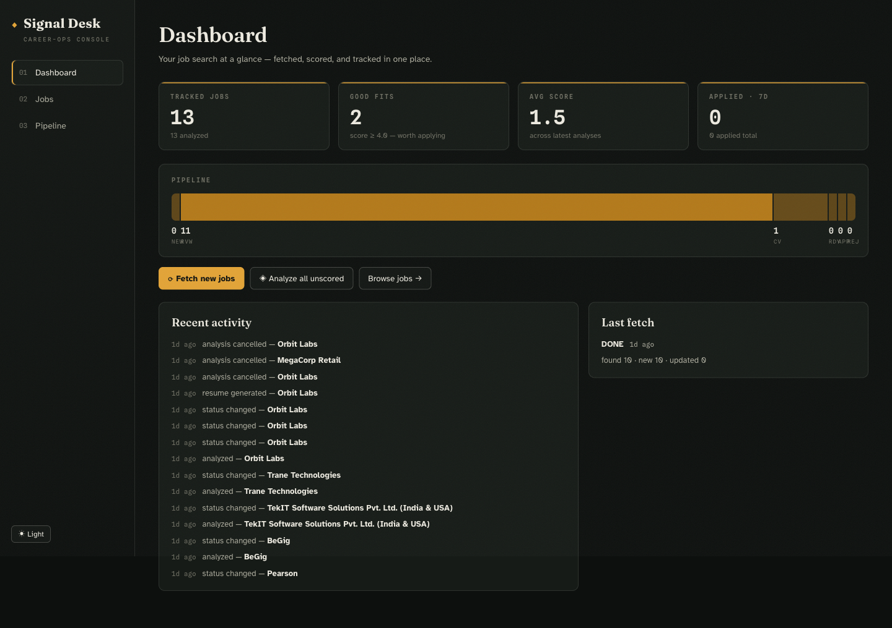
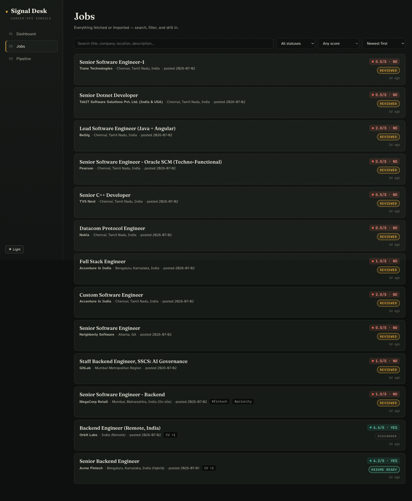
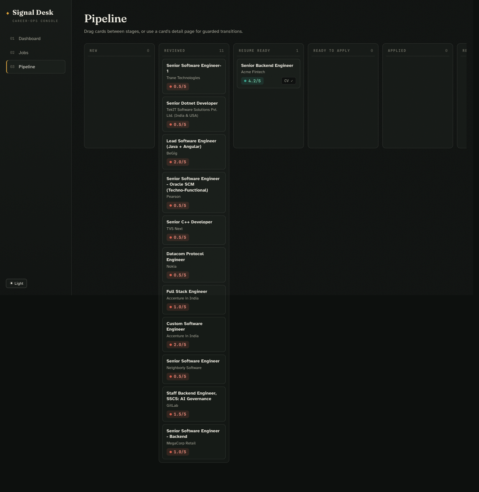
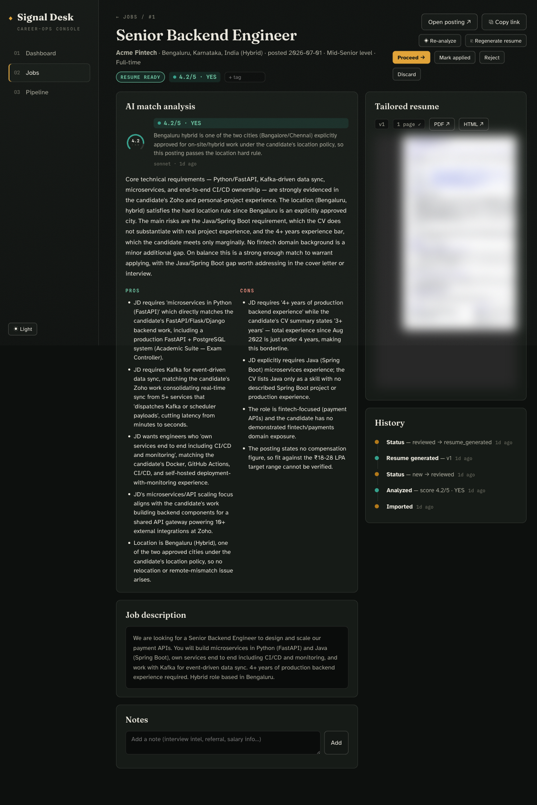

# Signal Desk — `job-hunter`

A **local-first web dashboard** for the whole job search: fetch postings, get an AI
match score against your CV, generate a tailored one-page resume, track application
status, and keep notes — all in one place. It replaces the old
n8n → Gemini → Telegram job-alert pipeline with a single app you run on `localhost`.

All AI processing runs through **your Claude Code subscription** via headless
`claude -p` — no external LLM API keys, no per-token billing.

```
┌──────────────┐   fetch/import   ┌───────────────┐   claude -p    ┌──────────────┐
│  Apify /     │ ───────────────▶ │  SQLite DB    │ ─────────────▶ │  Analysis    │
│  n8n / paste │                  │  data/jobs.db │                │  + Resume    │
└──────────────┘                  └───────┬───────┘                └──────┬───────┘
                                          │                               │
                                   React UI (Vite)                 writes back to
                                   localhost:4680             career-ops reports/tracker
```

## Screenshots

**Dashboard** — the whole search at a glance: stat tiles, a pipeline funnel, one-click
Fetch / Analyze-all, and a live activity feed.



**Jobs** — a filterable, sortable list with score chips and status badges.



**Pipeline** — a drag-and-drop Kanban board; move a card between columns to change status.



**Job detail** — the AI match analysis (score dial, reasoning, pros/cons), the inline
tailored-resume preview, and a full event timeline, with the Analyze → Resume → Proceed →
Applied actions across the top.



---

## Built on career-ops (the backbone)

This directory lives **inside** the [career-ops](../) repo and is its GUI. It does not
duplicate career-ops's evaluation logic — it **drives** it. career-ops files are both the
**source of truth** (what the AI reads) and the **destination** (where results land).

`server/paths.mjs` resolves the parent directory as `REPO_ROOT` and wires these
integration points:

| career-ops file / dir | Role in the dashboard | Read / Write |
|---|---|---|
| `cv.md` | Canonical CV — every factual claim in analysis + resume comes from here | Read |
| `config/profile.yml` | Candidate profile injected into the match prompt | Read |
| `modes/_profile.md` | Targeting/archetype narrative injected into the match prompt | Read |
| `Resume/resume.html` | Master one-page resume, tailored per job | Read |
| `Resume/<Company>/` | Where each tailored `resume.html` + `job-info.txt` + PDF is written | Write |
| `reports/{num}-{slug}-{date}.md` | Auto-generated evaluation report on Apply | Write |
| `batch/tracker-additions/*.tsv` | Tracker row (status-before-score contract) | Write |
| `merge-tracker.mjs` | Run to merge the TSV into `data/applications.md` | Exec |
| `config/match-rules.md` *(local)* | Hard location/comp rules — **this** repo's own file | Read |

Because of this, the dashboard honours career-ops's core rules automatically:

- **Truthfulness** — resume tailoring reorders/reframes/emphasises, but *never invents*
  ("keywords get reformulated, never fabricated"). No new employers, titles, dates,
  metrics, or authorship claims.
- **Quality over quantity** — a score below 4.0 shows an explicit "don't apply" nudge.
- **Never auto-submit** — the app fills, generates, and tracks, but applying stays in
  your hands (the last automated step just moves the job to *Ready to Apply*).
- **Pipeline integrity** — it never appends to `data/applications.md` directly; it writes
  a TSV + report and lets `merge-tracker.mjs` do the merge (exactly once per application).

> This directory is **user-layer**: career-ops `node update-system.mjs` never touches it.

The headless `claude -p` runs execute with `cwd = tmpdir`, so they do **not** load the
career-ops `CLAUDE.md`/project context — every prompt carries all the context it needs inline.

---

## Quick start

```bash
cd job-hunter
npm install                # server deps (express). SQLite is Node's built-in node:sqlite.
npm --prefix web install   # frontend deps (React + Vite)
npm run build              # build the React frontend into web/dist
npm start                  # → http://localhost:4680
```

**Dev mode (hot reload):**

```bash
npm run dev                # server with --watch on :4680
npm --prefix web run dev   # Vite dev server on :4681, proxies /api → :4680
```

**Requirements**

- **Node.js ≥ 22.5** — uses the built-in `node:sqlite` (`DatabaseSync`) and
  `process.loadEnvFile`. No `better-sqlite3`, no ORM.
- **Claude Code CLI** on your `PATH` (the `claude` binary) — powers analysis + resume tailoring.
- **Playwright** available (installed in the career-ops repo) — renders the resume PDF.
  Imported dynamically; if it's missing, the HTML resume is still written and the PDF step
  is skipped gracefully.
- **Apify token** (optional) — only needed for the "Fetch new jobs" LinkedIn scrape.

---

## The workflow

1. **Fetch** — "Fetch new jobs" runs the same Apify LinkedIn search the n8n workflow did
   (Bengaluru/Chennai hybrid + remote, query/lookback configurable in `.env`). Or POST any
   job list to `/api/import` (n8n-compatible shape) — an existing n8n workflow can keep
   pushing jobs here unchanged.
2. **Analyze** — each job is scored **0–5** against `cv.md` + `config/profile.yml` +
   `modes/_profile.md` + `config/match-rules.md`. Output: score, `YES`/`NO` verdict, pros,
   cons, reasoning, and a location check. A failed hard rule forces `NO` regardless of skill match.
3. **Review** — read the analysis, the JD, and the posting. Use the Kanban Pipeline board
   or the filterable Jobs list.
4. **Resume** — "Generate resume" tailors the master `Resume/resume.html` for the JD
   (truthfully — nothing invented), writes `Resume/<Company>/resume.html` + `job-info.txt`,
   renders a **one-page-verified PDF**, and shows it inline for review.
5. **Proceed** — moves the job to *Ready to Apply*. Applying itself stays in your hands
   (or ask Claude in-session to drive the browser — it will always stop before Submit).
6. **Applied** — records the application, then syncs it into the career-ops tracker exactly
   once: auto-report in `reports/`, TSV in `batch/tracker-additions/`, then `merge-tracker.mjs`.
7. **Notes / tags / statuses** — everything else is tracked on the job detail page.

**Status lifecycle:** `new → reviewed → resume_generated → ready_to_apply → applied`,
plus `rejected` / `discarded` as off-ramps.

---

## Directory layout

```
job-hunter/
├── server/
│   ├── index.mjs              # Express app: mounts routers, serves web/dist SPA
│   ├── paths.mjs              # Resolves career-ops repo paths + loads .env
│   ├── db.mjs                 # node:sqlite schema, status machine, event-log helpers
│   ├── routes/
│   │   ├── jobs.mjs           # /stats, /jobs list+detail, PATCH, notes, events
│   │   ├── ingest.mjs         # /import, /fetch, /fetch/runs
│   │   └── actions.mjs        # /ops, analyze, resume, proceed, applied
│   ├── services/
│   │   ├── apify.mjs          # LinkedIn scrape (ports the n8n fetch pipeline)
│   │   ├── importer.mjs       # Idempotent upsert-on-URL import
│   │   ├── claude.mjs         # Headless claude -p runner + analysis prompt
│   │   ├── resume.mjs         # Tailored resume + Playwright PDF render
│   │   ├── tracker.mjs        # Applied → career-ops report/TSV/merge sync
│   │   └── ops.mjs            # In-memory op registry, sequential queue, cancellation
│   └── smoke-test.mjs         # Offline DB/import/status tests (no network, no Claude)
├── web/                       # React + Vite frontend
│   └── src/
│       ├── App.jsx            # Shell, sidebar, live-ops indicator, theme toggle
│       ├── api.js             # fetch client, useApi/useOps hooks, status metadata
│       ├── components.jsx     # StatTile, ScoreDial, StatusBadge, Modal, …
│       └── pages/             # Dashboard, Jobs, Pipeline (Kanban), JobDetail
├── config/match-rules.md      # Hard location/comp rules (user-editable)
├── fixtures/sample-jobs.json  # Sample data for smoke tests
├── data/                      # jobs.db (+ WAL), server.log — gitignored
└── .env                       # Local config — gitignored (see .env.example)
```

---

## Data model (`data/jobs.db`, SQLite / WAL)

| Table | Purpose |
|---|---|
| `jobs` | One row per posting. Unique on `url` (upsert key). Holds status + tags. |
| `analyses` | Every analysis run (history kept). Score, verdict, pros/cons, reasoning, model. |
| `resumes` | Every tailored resume version: dir, html/pdf paths, page count. |
| `applications` | One row per applied job (unique). Records `tracker_num` once synced. |
| `notes` | Free-text notes per job. |
| `events` | Append-only audit log (imported, analyzed, resume_generated, applied, …). |
| `fetch_runs` | Each Apify fetch: found/imported/updated counts, status, errors. |

State is fully derivable from the DB — see *Resumable & idempotent* below.

---

## Configuration (`.env`)

Copy `.env.example` → `.env` and fill in what you need.

| Var | Meaning | Default |
|---|---|---|
| `APIFY_TOKEN` | Apify API token (required only for Fetch) | — |
| `APIFY_ACTOR` | scraper actor | `curious_coder~linkedin-jobs-scraper` |
| `JOB_SEARCH_QUERY` | LinkedIn keywords | `Backend Engineer OR Senior Backend Engineer` |
| `LOOKBACK_HOURS` | posting recency window | `24` |
| `FETCH_COUNT` | max jobs per fetch | `10` |
| `PORT` | server port | `4680` |
| `CLAUDE_MODEL` | model for headless analysis/tailoring | `sonnet` |
| `RESUME_PDF_NAME` | PDF filename inside `Resume/<Company>/` | `Viswanathan-T-J-Resume.pdf` |

Hard match rules — location policy, comp floor, strictness — live in
`config/match-rules.md`. The analyzer reads it **fresh on every run**, so edits take effect
immediately without a restart.

---

## API (all under `/api`)

**Jobs & stats**

| Method + path | Purpose |
|---|---|
| `GET /health` | Liveness probe |
| `GET /stats` | Dashboard counters: totals by status, avg score, good fits, last fetch, recent events |
| `GET /jobs` | List jobs. Query: `q, status, tag, minScore, sort` (`created`/`score`/`company`/`posted`/`updated`), `dir` |
| `GET /jobs/:id` | Full job detail: analyses, resumes, notes, events, application |
| `PATCH /jobs/:id` | Update `status` and/or `tags` |
| `POST /jobs/:id/notes` | Add a note |
| `GET /jobs/:id/events` | Full event log for a job |

**Ingest**

| Method + path | Purpose |
|---|---|
| `POST /import` | Import a job array or `{ jobs: [...] }` (n8n-compatible shape). Idempotent upsert on URL |
| `POST /fetch` | Kick off a background Apify LinkedIn fetch (`202`; `409` if one is running) |
| `GET /fetch/runs` | Recent fetch runs with counts/status |

**Actions**

| Method + path | Purpose |
|---|---|
| `POST /jobs/:id/analyze` | Queue analysis (`force` to redo). Skips if one exists |
| `POST /analyze-all` | Queue analysis for every un-analyzed, non-discarded job |
| `POST /jobs/:id/resume` | Queue tailored-resume generation (`force` to regenerate) |
| `GET /jobs/:id/resume/file?type=pdf\|html` | Stream the tailored resume inline |
| `POST /jobs/:id/proceed` | Move to `ready_to_apply` |
| `POST /jobs/:id/applied` | Mark applied → sync to career-ops tracker (once). Body: `notes`, `method` |
| `GET /ops` | Snapshot of running/queued background work (UI polls this every 2.5s) |
| `POST /ops/cancel` | Cancel a queued/running op by `key` |

Long-running work (fetch, analyze, resume) returns `202` immediately; the frontend polls
`/api/ops` and refetches when an op finishes.

---

## Resumable & idempotent

Every step derives from DB state (`data/jobs.db`), so the app is safe to interrupt:

- **Import upserts on job URL** — re-imports and re-fetches never duplicate; they refresh
  description/`posted_at` if changed.
- **Analyze / resume skip existing work** — use `force` / *Regenerate* to redo; every run
  is kept as history.
- **Tracker sync happens exactly once per application** (guarded by `tracker_num`). On
  failure it cleans up any orphan report/TSV so a retry writes fresh ones — the *Applied*
  state itself is never rolled back.
- **Sequential AI queue** — analysis and resume runs go through one queue; parallel
  `claude -p` spawns never happen. Ops can be cancelled while queued or running.
- Kill the server at any point; restart continues where things stood.

---

## Frontend

React 18 + React Router, built with Vite, no component library — a single hand-written
`styles.css` with a dark/light theme toggle (persisted to `localStorage`).

- **Dashboard** — stat tiles, pipeline funnel, recent activity, one-click Fetch / Analyze-all.
- **Jobs** — filterable/sortable list with score chips and status badges.
- **Pipeline** — Kanban board; drag a card between columns to change status.
- **Job Detail** — analysis (score dial, pros/cons, reasoning), resume preview (inline PDF),
  notes, tags, event timeline, and the Analyze → Resume → Proceed → Applied action buttons.

In production the Express server serves the built SPA from `web/dist` and falls back to
`index.html` for client-side routes.

---

## Testing

```bash
npm run smoke     # offline: DB init, import idempotency, status transitions
```

The smoke test runs against a separate `data/smoke.db` — **no network, no `claude -p`,
no career-ops writes** — using `fixtures/sample-jobs.json`.

---

## Notes & limitations

- LinkedIn blocks iframes, so "preview the posting" means the **stored JD text + an Open
  posting button**, not an embedded page.
- Fetch is tuned for the author's search (Chennai/Bengaluru hybrid + remote, Backend roles).
  Change the query in `.env` and the location/comp policy in `config/match-rules.md`.
- The `data/` directory (DB, logs) and `.env` are gitignored — this is local-first by design.
